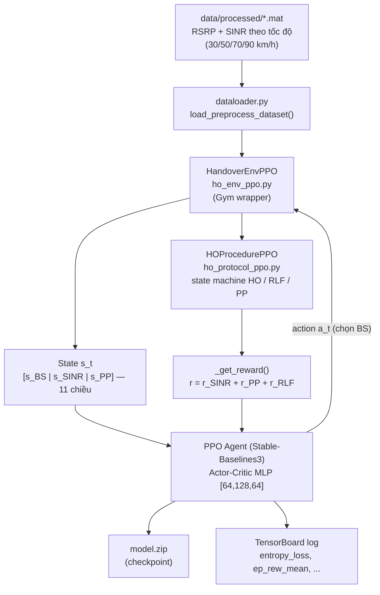
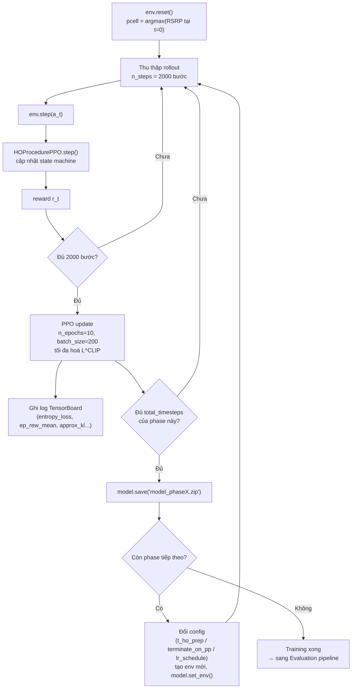
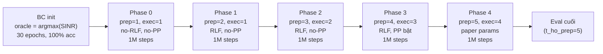
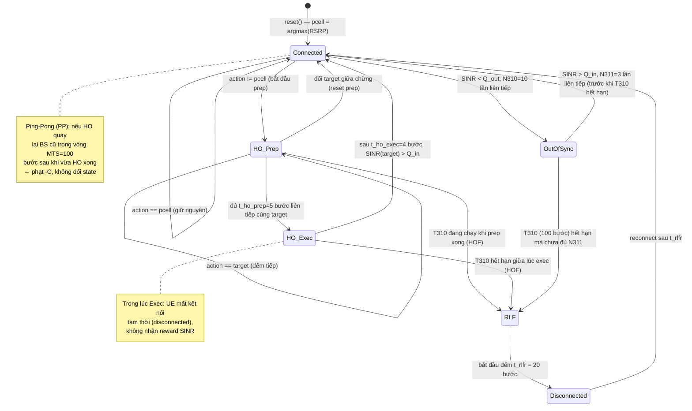
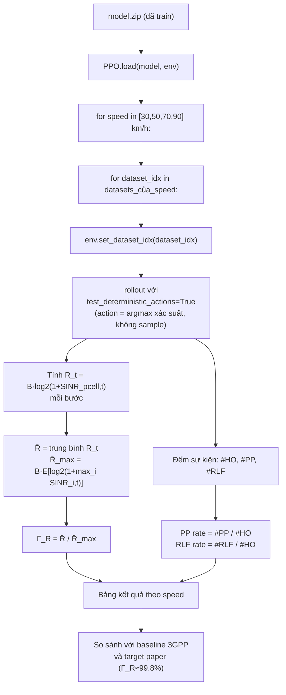
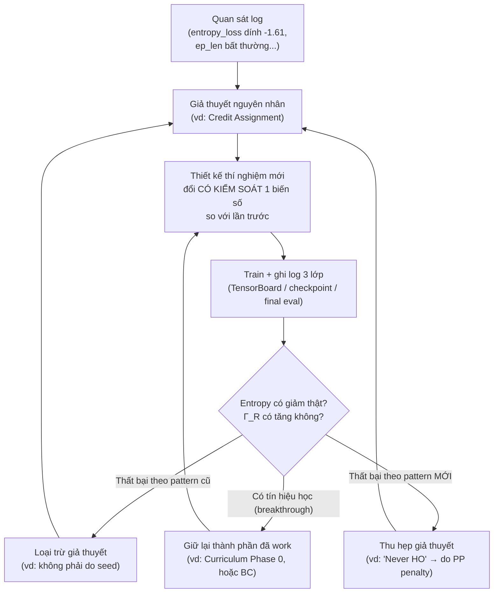

# Sơ đồ Pipeline: DRL Handover Optimization

> Bổ sung trực quan cho `TAI_LIEU_ON_TAP.md`. Các sơ đồ dùng cú pháp **Mermaid** — GitHub tự
> render thành hình khi xem file này trên web (không cần cài gì thêm). Nếu xem bằng editor
> không hỗ trợ Mermaid (VD Notepad), đọc phần text thô cũng vẫn hiểu được luồng.

---

## 1. Kiến trúc tổng thể — Data → Environment → Agent

**Đọc sơ đồ:** dữ liệu SINR/RSRP đã pre-compute (không mô phỏng radio online) được nạp vào
môi trường Gym; state machine trong `ho_protocol_ppo.py` quyết định HO/RLF/PP có xảy ra hay
không dựa trên action của agent; reward được tính rồi phản hồi ngược lại PPO để cập nhật
policy — đúng vòng lặp MDP kinh điển (state → action → reward → state mới).

---

## 2. Training pipeline (một vòng rollout–update của PPO)

**Điểm cần nhớ khi giải thích:** bước `L` (đổi config giữa các phase) chính là cơ chế
**curriculum** — mỗi lần đổi phase phải tạo lại environment vì `HOProcedurePPO.__init__` đọc
config tại thời điểm khởi tạo, không tự cập nhật nếu config đổi sau đó.

---

## 3. Multi-phase / Curriculum training theo thời gian (ví dụ V3 — BC + Gradual Curriculum)

Đây là dạng tổng quát của "curriculum learning": độ khó bài toán (`t_ho_prep`) và mức phạt
(`terminate_on_pp`) tăng dần từng bước, thay vì nhảy thẳng vào cấu hình khó nhất (paper params)
ngay từ đầu — vì nhảy thẳng khiến Credit Assignment Problem xuất hiện ngay lập tức (xem V1).

---

## 4. HO Protocol — State Machine (trái tim của `ho_protocol_ppo.py`)

**Vì sao sơ đồ này quan trọng nhất khi giải thích cho cô:** toàn bộ 11 lần thí nghiệm thất
bại đều xoay quanh việc policy có vượt qua được nhánh `Connected → HO_Prep → HO_Exec →
Connected` hay không (Credit Assignment Problem — nhánh này hiếm khi được đi qua với policy
ngẫu nhiên), và nếu đi qua được thì có kẹt ở nhánh `→ RLF` hay không (vấn đề dự đoán 9-bước).

---

## 5. Evaluation pipeline (tính Γ_R / PP rate / RLF rate)

Script tương ứng: `validate_ppo.py` (model gốc), `evaluate_all.py` (so sánh nhiều model),
`eval_checkpoints.py` (eval checkpoint giữa chừng bằng đúng config lúc nó được train),
`eval_v4.py` (eval các biến thể V4).

---

## 6. Vòng lặp phương pháp luận — cách 11 thí nghiệm nối tiếp nhau

**Áp dụng thực tế vào 4 vòng V1→V4:**

| Vòng | Input (mang từ vòng trước) | Output (mang sang vòng sau) |
|---|---|---|
| V1 | Giả thuyết đơn giản: chỉ cần fix bug + đúng 2-phase | Xác nhận Credit Assignment Problem là root cause |
| V2 | 4 hướng tấn công root cause theo cơ chế khác nhau | Curriculum Phase 0 work + BC work (nhưng PPO fine-tune phá hỏng) |
| V3 | Kết hợp BC + curriculum mượt (5 phase thay vì 3) | Phát hiện `ent_coef=0.01` có thể là nguyên nhân entropy collapse sớm |
| V4 | 4 biến thể kiểm soát biến để test giả thuyết `ent_coef` | Bác bỏ "chỉ cần ent_coef cao hơn" và "chỉ cần train lâu hơn"; chốt lại 2 pattern thất bại cuối cùng |

---

*Xem `TAI_LIEU_ON_TAP.md` để có phần giải thích chi tiết bằng chữ đi kèm mỗi sơ đồ.*
